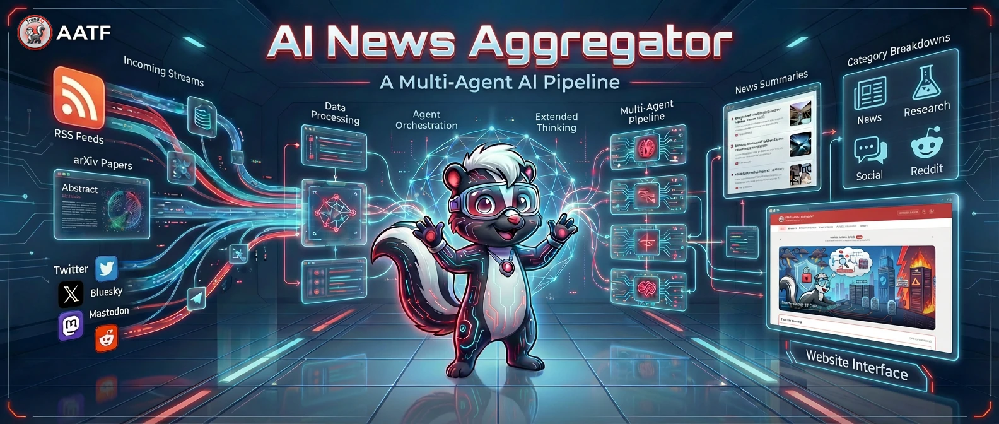
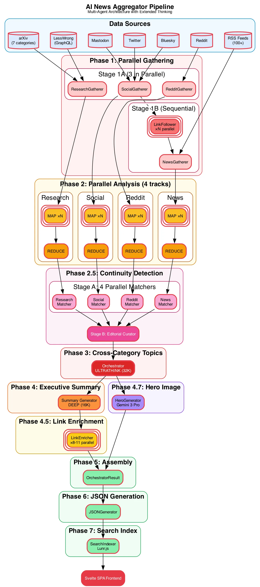

# AI News Aggregator



> Multi-agent AI news pipeline powered by Claude Opus 4.5 with extended thinking

> **Live Site:** [https://news.aatf.ai](https://news.aatf.ai)

[](LICENSE)
[](https://www.python.org/)
[](https://www.docker.com/)

Daily AI/ML news briefings curated by specialized agents with extended thinking. Updated every morning at 6 AM ET.

---

## Navigation

| Section | Description |
|---------|-------------|
| [What It Does](#what-it-does) | Key stats and capabilities |
| [How It Works](#how-it-works) | Pipeline phases, thinking levels, architecture |
| [Quick Start](#quick-start) | Docker and local setup |
| [Configuration](#configuration) | Provider modes, prompts, data sources |
| [Features](#features) | Multi-agent, continuity detection, frontend |
| [Architecture](#architecture) | Directory structure, agent pairs, data output |
| [Frontend Development](#frontend-development) | Dev server, build, URL routes |
| [Operational Notes](#operational-notes) | arXiv schedule, date semantics |
| [Local Development](#local-development) | Pipeline dev, hero regeneration |
| [Contributing](#contributing) | How to contribute |

---

## What It Does

A Python-based pipeline that collects AI/ML news from multiple sources, analyzes them using specialized agents with Claude's extended thinking, and serves a modern Svelte SPA frontend.

**Key Stats:**
- **100+ RSS feeds** from AI news sites, blogs, and research organizations
- **7 arXiv categories** (cs.AI, cs.LG, cs.CL, cs.CV, cs.NE, cs.RO, stat.ML)
- **6 social platforms** (Twitter, Bluesky, Mastodon, Reddit, LessWrong, research blogs)
- **~80-85K thinking tokens** per daily run
- **Daily hero image** generated with AATF skunk mascot

---

## How It Works



### The Multi-Phase Pipeline

| Phase | Description | Thinking Level |
|-------|-------------|----------------|
| **0. Ecosystem Context** | Load AI model release dates for LLM grounding | - |
| **1. Parallel Gathering** | 4 gatherers collect from RSS, arXiv, Twitter, Reddit, Bluesky, Mastodon | - |
| **2. Parallel Analysis** | MAP-REDUCE pattern: batch items (75 each), analyze, then synthesize | STANDARD (8K) → DEEP (16K) |
| **2.5. Continuity Detection** | Track developing stories, detect rehashes, link related coverage | - |
| **3. Cross-Category Topics** | Identify 3-6 themes spanning all categories | ULTRATHINK (32K) |
| **4. Executive Summary** | Generate daily briefing (500-800 words) | DEEP (16K) |
| **4.5. Link Enrichment** | Inject internal links to referenced items | STANDARD (8K) |
| **4.6. Ecosystem Enrichment** | Auto-detect new model releases from news | STANDARD (8K) |
| **4.7. Hero Image** | Generate branded banner with Gemini 3 Pro | - |
| **5-7. Output** | JSON data generation + RSS feeds + Lunr.js search index | - |

### Extended Thinking Levels

| Level | Budget | Use Case |
|-------|--------|----------|
| QUICK | 4,096 tokens | Link relevance decisions |
| STANDARD | 8,192 tokens | Batch analysis, link enrichment |
| DEEP | 16,000 tokens | Category ranking, executive summary |
| ULTRATHINK | 32,000 tokens | Cross-category topic detection |

### Agent Architecture


---

## Quick Start

### Option A: Docker (Recommended)

```bash
# Clone the repository
git clone https://github.com/flyryan/ai-news-aggregator.git
cd ai-news-aggregator

# Create config file
cp config/providers.yaml.example config/providers.yaml
# Edit config/providers.yaml with your API keys

# Build and run
docker-compose build
docker-compose up -d
```

Open [http://localhost:8080](http://localhost:8080)

### Option B: Local Development

```bash
# Clone and setup
git clone https://github.com/trend-ai-acceleration-task-force/ai-news-aggregator.git
cd ai-news-aggregator

# Python setup
python3 -m venv venv
source venv/bin/activate
pip install -r requirements.txt

# Create config
cp config/providers.yaml.example config/providers.yaml
# Edit config/providers.yaml with your API keys

# Run pipeline
python3 run_pipeline.py --config-dir ./config --data-dir ./data --web-dir ./web

# Frontend development (separate terminal)
cd frontend
npm install
npm run dev
# Open http://localhost:5173
```

### Manual Pipeline Run

```bash
# Run pipeline (local)
python3 run_pipeline.py

# Run pipeline (Docker)
docker exec ai-news-aggregator python3 /app/run_pipeline.py

# Run for a specific date
python3 run_pipeline.py -d 2026-01-05

# Enable scheduled collection (cron, Docker only)
ENABLE_CRON=true docker-compose up -d
```

---

## Configuration

All configuration is done via `config/providers.yaml`. Copy the example file and customize:

```bash
cp config/providers.yaml.example config/providers.yaml
```

### LLM Provider

Supports two modes:

| Mode | Description | Auth | Extended Thinking |
|------|-------------|------|-------------------|
| `anthropic` (default) | Direct Anthropic API | x-api-key header | Full support |
| `openai-compatible` | LiteLLM, vLLM, or other proxies | Bearer token | May not be supported |

**Direct Anthropic API:**

```yaml
llm:
  mode: "anthropic"
  api_key: "${ANTHROPIC_API_KEY}"  # Use env var reference
  # base_url: "https://api.anthropic.com"  # Default, uncomment to override
  model: "claude-opus-4-5-20251101"
  timeout: 300
```

**OpenAI-compatible proxies (LiteLLM, etc.):**

```yaml
llm:
  mode: "openai-compatible"
  api_key: "${PROXY_API_KEY}"
  base_url: "https://your-litellm-proxy.example.com"
  model: "claude-opus-4-5"  # Your proxy's model alias
  timeout: 300
```

### Image Provider (Optional)

Hero image generation is optional. Comment out the entire `image:` section to skip.

| Mode | Description | Requirements |
|------|-------------|--------------|
| `native` (default) | Google Gemini API via google-genai SDK | Google AI API key |
| `openai-compatible` | OpenAI-compatible image endpoint | Proxy endpoint + key |

```yaml
image:
  mode: "native"
  api_key: "${GOOGLE_API_KEY}"
  model: "gemini-3-pro-image-preview"
```

If no image provider is configured, the pipeline runs successfully without hero images.

### Pipeline Settings

```yaml
pipeline:
  base_url: "http://localhost:8080"  # Your deployment URL (used in RSS feeds)
  lookback_hours: 24  # How far back to collect news
```

### Environment Variables

You can reference environment variables in your YAML config using `${VAR_NAME}` syntax:

```bash
export ANTHROPIC_API_KEY="your-key-here"
export GOOGLE_API_KEY="your-key-here"
export TWITTERAPI_IO_KEY="your-key-here"  # Optional, for Twitter collection
```

| Variable | Description | Required |
|----------|-------------|----------|
| `ANTHROPIC_API_KEY` | Anthropic API key | Yes |
| `GOOGLE_API_KEY` | Google AI API key | No (hero images) |
| `TWITTERAPI_IO_KEY` | TwitterAPI.io key ($0.15/1000 tweets) | No |
| `TARGET_DATE` | Report date (YYYY-MM-DD) | No |
| `ENABLE_CRON` | Enable scheduled collection | No |
| `COLLECTION_SCHEDULE` | Cron schedule (default: `0 6 * * *`) | No |
| `TZ` | Timezone (default: `America/New_York`) | No |

### Prompt Customization

All LLM prompts are externalized to `config/prompts.yaml`. You can customize analysis behavior without changing code:

```yaml
# Example: Customize the executive summary prompt
orchestration:
  executive_summary: |
    Write a structured executive summary of today's AI news...

    FORMAT YOUR SUMMARY LIKE THIS:
    #### Top Story
    ...
```

Prompt categories:
- **gathering** - Link relevance decisions
- **analysis** - Category-specific analysis (news, research, social, reddit)
- **orchestration** - Cross-category topic detection, executive summary
- **post_processing** - Link enrichment, ecosystem enrichment

Variables use `${var}` syntax and are resolved at runtime.

### Adding Data Sources

Edit files in `config/`:

| Source Type | Config File | Format |
|-------------|-------------|--------|
| RSS feeds | `rss_feeds.txt` | One URL per line |
| Research blogs | `research_feeds.txt` | LessWrong, AI Alignment Forum URLs |
| Twitter | `twitter_accounts.txt` | Usernames (requires TWITTERAPI_IO_KEY) |
| Bluesky | `bluesky_accounts.txt` | Handles (e.g., `karpathy.bsky.social`) |
| Mastodon | `mastodon_accounts.txt` | Full addresses (e.g., `user@mastodon.social`) |
| Reddit | `reddit_subreddits.txt` | Subreddit names (free, no key needed) |

### Model Release Tracking

The pipeline tracks AI model releases to ground LLM analysis:

```yaml
# config/model_releases.yaml
openai:
  GPT-5.2:
    ga_date: "2026-01-10"
    api_date: "2026-01-11"
```

Phase 4.6 auto-detects new releases from daily news and updates this file.

---

## Features

### Multi-Agent Architecture
- **4 Gatherer agents** collecting from different source types in parallel
- **4 Analyzer agents** with MAP-REDUCE batching for scalability
- **Continuity detection** tracks developing stories across days

### Continuity Detection
Automatically identifies when today's stories continue from previous coverage:
- **Continuation types**: `new_development` (builds on prior story), `mainstream_pickup` (gains wider attention), `community_reaction` (discussion response), `rehash` (repetitive coverage), `follow_up` (next chapter)
- **Smart ranking**: Items flagged as `rehash` can be demoted from top stories
- **2-day lookback**: Compares against items from the past 2 days

### Extended Thinking
- Configurable thinking budgets from 4K to 32K tokens
- ULTRATHINK mode for complex cross-category analysis
- **Cost tracking**: Per-phase breakdown with input/output/cache token tracking, logged at end of each run

### Ecosystem Grounding
Prevents hallucinations about AI model releases by injecting accurate release dates into analyzer prompts:
- **Dual date tracking**: GA (General Availability) date vs API date for each model
- **Curated source of truth**: `config/model_releases.yaml` with verified dates from Nov 2025+
- **OpenRouter integration**: Auto-discovers new models and API availability dates
- **Agent enrichment**: Phase 4.6 auto-detects new model releases from daily news and updates the context

### Collection Status Tracking
Each pipeline run tracks collection status per source:
- **Status values**: `success`, `partial` (some items collected), `failed`
- **Per-source tracking**: News, Research, Social, Reddit
- **Per-platform tracking**: Twitter, Bluesky, Mastodon (within Social)
- Status is included in `summary.json` and displayed in the frontend

### Data Sources

| Category | Sources | Collection Method |
|----------|---------|-------------------|
| **News** | 100+ RSS feeds + linked articles | RSS + LLM-guided link following |
| **Research** | arXiv (7 categories) + LessWrong | RSS/OAI-PMH + GraphQL API |
| **Social** | Twitter, Bluesky, Mastodon | TwitterAPI.io + free APIs |
| **Reddit** | Configurable subreddits | JSON endpoint (free) |

### Frontend Features
- **AATF Branding** - Trend Red (#E63946) color scheme with skunk mascot
- **Calendar Navigation** - Browse historical reports by date
- **Full-text Search** - Client-side search using Lunr.js indexes
- **Dark Mode** - System-aware with manual toggle
- **Responsive Design** - Mobile-first with Tailwind CSS

### Daily Hero Image
Each report includes a generated hero image featuring the AATF skunk mascot in a scene representing the day's top stories, created via Gemini 3 Pro.

### RSS Feeds
Multiple Atom 1.0 feeds for different use cases:
- **Main Feed** - Executive summary + top 5 items per category
- **Daily Briefing** - Executive summaries only with hero image
- **Category Feeds** - News, Research, Social, Reddit separately
- **Summary Feeds** - All category summaries

---

## Architecture

### Directory Structure

```
ai-news-aggregator/
├── agents/
│   ├── llm_client.py          # Anthropic client with extended thinking
│   ├── base.py                # BaseGatherer, BaseAnalyzer classes
│   ├── orchestrator.py        # Main coordinator
│   ├── ecosystem_context.py   # AI model release dates for LLM grounding
│   ├── link_enricher.py       # Adds internal links to summaries
│   ├── cost_tracker.py        # LLM API cost tracking
│   ├── gatherers/             # News, Research, Social, Reddit gatherers
│   ├── analyzers/             # Category-specific analyzers
│   └── continuity/            # Story tracking across days
├── generators/
│   ├── json_generator.py      # JSON data for SPA frontend
│   ├── search_indexer.py      # Lunr.js search index builder
│   ├── feed_generator.py      # Atom RSS feeds
│   └── hero_generator.py      # Daily hero image with skunk mascot
├── frontend/                  # Svelte SPA
│   ├── src/
│   │   ├── lib/components/    # UI components
│   │   ├── lib/stores/        # State management
│   │   ├── lib/services/      # Data loading, search
│   │   └── routes/            # SvelteKit routing
│   └── static/assets/         # Logo, fonts
├── config/
│   ├── providers.yaml         # Provider configuration
│   ├── prompts.yaml           # LLM prompts (customizable)
│   ├── rss_feeds.txt          # RSS feed URLs
│   ├── model_releases.yaml    # AI model release dates
│   └── ...                    # Other source lists
├── data/                      # Raw and processed JSON
├── web/                       # Generated output
├── assets/                    # Pipeline diagrams
├── run_pipeline.py            # Entry point
├── Dockerfile
└── docker-compose.yml
```

### Agent Pairs

| Category | Gatherer | Analyzer Focus |
|----------|----------|----------------|
| **News** | RSS + linked articles from social | Product releases, company news |
| **Research** | arXiv + LessWrong GraphQL | Papers, breakthroughs |
| **Social** | Twitter, Bluesky, Mastodon | Discussions, reactions |
| **Reddit** | Reddit JSON API | Community debates |

### Data Output

```
web/data/
├── index.json              # Date manifest
├── search-index.json       # Lunr.js index (30-day window)
├── search-documents.json   # Document lookup
├── feeds/                  # Atom RSS feeds
│   ├── main.xml
│   ├── summaries-executive.xml
│   └── ...
└── {YYYY-MM-DD}/
    ├── summary.json        # Executive summary + top items
    ├── hero.webp           # Daily hero image
    ├── news.json           # Full news items
    ├── research.json       # Full research items
    ├── social.json         # Full social items
    └── reddit.json         # Full reddit items
```

---

## Frontend Development

```bash
cd frontend
npm install              # Install dependencies
npm run dev              # Start dev server (http://localhost:5173)
npm run build            # Build production (outputs to ../web)
npm run check            # TypeScript type checking
```

### URL Routes

| Route | Content |
|-------|---------|
| `/` | Redirects to latest date |
| `/?date=2026-01-05` | Specific date overview |
| `/?date=2026-01-05&category=research` | Category page |
| `/archive` | Calendar browser |
| `/feeds` | RSS feed directory |
| `/about` | Project info and AI disclaimer |

---

## Operational Notes

### arXiv Collection Schedule
- Papers announced Sun-Thu ~8PM ET
- **Sat/Sun reports**: Skip arXiv (no new papers)
- **Monday reports**: 3-day catchup (Sat-Mon announcements)

### Date Semantics
- `TARGET_DATE` = report date
- Coverage period = day BEFORE report date (00:00-23:59 ET)
- Example: `TARGET_DATE=2026-01-05` covers news from January 4th

### LessWrong Collection
Uses GraphQL API instead of RSS because RSS doesn't support date-range queries - only returns the ~10-20 most recent posts which scroll off within hours.

### Item IDs
12-character SHA256 hashes (~280 trillion unique values) for compact, stable URLs.

---

## Local Development

### Pipeline Development

```bash
# Create and activate virtual environment
python3 -m venv venv
source venv/bin/activate

# Install dependencies
pip install -r requirements.txt

# Run pipeline
python3 run_pipeline.py --config-dir ./config --data-dir ./data --web-dir ./web
```

### Hero Image Regeneration

The `regenerate_hero.py` script regenerates hero images for daily reports.

```bash
# Basic usage (prompts for confirmation)
python3 scripts/regenerate_hero.py 2026-01-06

# Auto-confirm (no prompt)
python3 scripts/regenerate_hero.py 2026-01-06 -y

# With custom prompt override
python3 scripts/regenerate_hero.py 2026-01-06 --prompt "Custom scene description"

# Regenerate ALL dates
python3 scripts/regenerate_hero.py -a

# Skip specific dates or ranges
python3 scripts/regenerate_hero.py -a -s 2026-01-05              # Skip one date
python3 scripts/regenerate_hero.py -a -s 2026-01-05:2026-01-08   # Skip range (inclusive)
python3 scripts/regenerate_hero.py -a -s 2026-01-01,2026-01-05   # Skip multiple

# Parallel processing (faster for --all)
python3 scripts/regenerate_hero.py -a -t 4                        # 4 parallel threads

# Edit existing image instead of regenerating
python3 scripts/regenerate_hero.py 2026-01-06 -e "Add a coffee cup to the scene"
```

### Other Utility Scripts

| Script | Purpose |
|--------|---------|
| `daily_pipeline.sh` | Cron wrapper: pulls latest, runs pipeline, auto-commits and pushes results |
| `cleanup_external_links.py` | Strips external links from topic descriptions and re-enriches with internal links only |
| `convert_hero_images.py` | One-time migration: converts PNG hero images to WebP format |
| `patch_news_notice.py` | One-time: adds collection start notice to early dates |

---

## Requirements

- **Python 3.10+**
- **Node.js 18+** (for frontend development)
- **Docker & Docker Compose** (for containerized deployment)
- **Claude Opus 4.5** (recommended for best analysis quality)
- **Gemini 3 Pro** (optional, for hero image generation)

### API Keys

| Service | Required | Cost | Purpose |
|---------|----------|------|---------|
| Anthropic API | Yes | Pay-per-token | LLM analysis |
| Google AI | No | Pay-per-image | Hero images |
| TwitterAPI.io | No | $0.15/1000 tweets | Twitter collection |

---

## Contributing

Contributions are welcome!

- **Bug Reports**: [Open an issue](https://github.com/flyryan/ai-news-aggregator/issues)
- **Feature Requests**: [Open an issue](https://github.com/flyryan/ai-news-aggregator/issues)
- **Pull Requests**: Fork, make changes, submit PR

Please ensure your contributions maintain backwards compatibility with existing configurations.

---

## License

Apache License 2.0 - See [LICENSE](LICENSE) file for details.

Copyright 2026 AI Acceleration Task Force (AATF)

---

## Built by TrendAI

**AI Acceleration Task Force** | [TrendAI](https://www.trendmicro.com)

Originally built as an internal tool to keep our team informed about AI developments, now open-sourced so others can run their own instances.

---

**Interested in being a Trender?** [Join us!](https://www.trendmicro.com/en_us/about/careers.html)
